<div align="center">


<br>

<a href="#-the-widgets"></a>
<a href="#-pit-lane-setup"></a>
<a href="#-telemetry-backend"></a>


### *The F1 data layer that lives everywhere.*

Glanceable F1 widgets for your home screen, lock screen, Widgets board and desktop,<br>
plus the backend that feeds them. **The widgets are the product.** The apps only configure and preview them.

[**Widgets**](#-the-widgets) · [**How it works**](#-how-it-works) · [**Setup**](#-pit-lane-setup) · [**Backend**](#-telemetry-backend) · [**Docs**](#-paddock-docs)

</div>


## 🏁 The widgets

Real renders, straight from `windows/APEX/Assets/Screenshots`. Each one has a small, medium and large size, and
comes in dark, AMOLED and light themes.

<table>
<tr>
<td align="center" width="20%">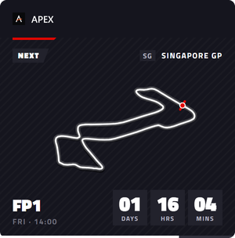<br><sub><b>APEX · Race Mode</b><br>what matters <i>now</i></sub></td>
<td align="center" width="20%">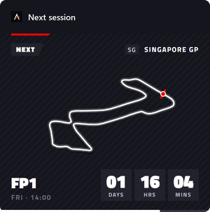<br><sub><b>Next session</b><br>what's next, and when</sub></td>
<td align="center" width="20%">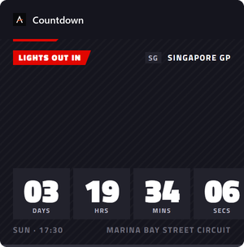<br><sub><b>Countdown</b><br>until lights out</sub></td>
<td align="center" width="20%">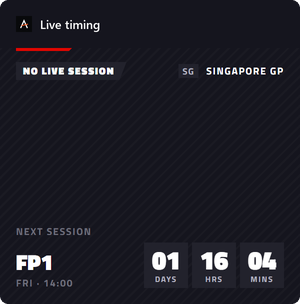<br><sub><b>Live timing</b><br>who's leading, by how much</sub></td>
<td align="center" width="20%">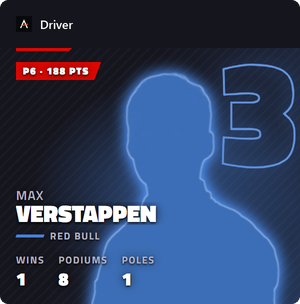<br><sub><b>Driver</b><br>their season at a glance</sub></td>
</tr>
<tr>
<td align="center">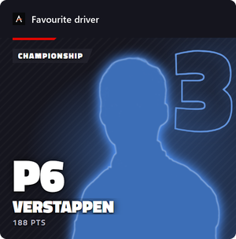<br><sub><b>Favourite driver</b><br>whatever matters right now</sub></td>
<td align="center">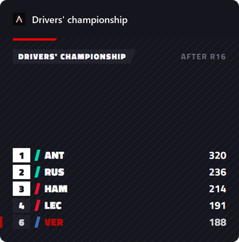<br><sub><b>Drivers' championship</b><br>the title fight</sub></td>
<td align="center">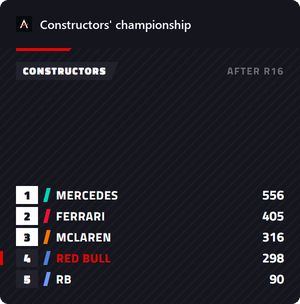<br><sub><b>Constructors'</b><br>team standings</sub></td>
<td align="center">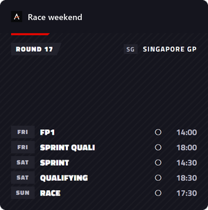<br><sub><b>Race weekend</b><br>every session</sub></td>
<td align="center">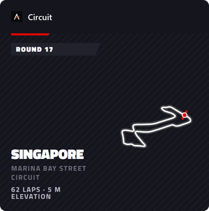<br><sub><b>Circuit</b><br>the next track in 3D</sub></td>
</tr>
</table>

> [!TIP]
> **Race Mode** flips itself: countdown → 🔴 LIVE timing → results → next session, right on the start time, with no
> network call needed. The 3D tracks are built from a real lap of an earlier race at that circuit.


## 🏎️ The grid

<div align="center"></div>

| Folder | What | State |
|---|---|---|
| `windows/` | Windows App SDK Widgets Board provider (COM) + Adaptive Cards, WinUI companion window | 🟢 builds |
| `android/` | Kotlin, Jetpack Glance (9 responsive widgets), WorkManager, Material 3 app | 🟢 builds, lint clean |
| `ios/` | SwiftUI + WidgetKit (9 widgets, lock screen), App Intents, Live Activity + Dynamic Island | 🟡 source; needs Xcode |
| `backend/` | FastAPI + SQLAlchemy + Redis/memory cache, Jolpica ingest, OpenF1 live timing, SSE, web preview | 🟢 runs, tests pass |
| `shared/` | design tokens, brand marks, OpenAPI schema | — |


## 📡 How it works

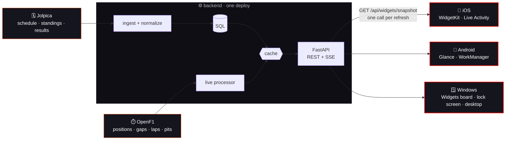

<details>
<summary><b>🧠 Why it's built this way</b> (click to open)</summary>
<br>

| Decision | Why |
|---|---|
| **One snapshot endpoint** | A widget refresh is one request, not six. Battery and network come first. |
| **Race Mode computed on the client** | Widgets flip *Countdown → LIVE* at the start time without a network request. |
| **SSE for apps, timelines for widgets** | OS widget processes can't hold sockets; the apps and Live Activities stream, widgets get budgeted reloads. |
| **Never-empty widgets** | Every client keeps the last snapshot and shows `LAST UPDATED 2m AGO` when the network fails. |
| **Local session notifications** | Start times are known days ahead, so no push infrastructure is needed. |

Full story in [`docs/ARCHITECTURE.md`](docs/ARCHITECTURE.md).

</details>


## 🔧 Pit lane setup

Pick your platform. Every box opens.

<details open>
<summary><h3>🪟 Windows · desktop, Widgets board, lock screen</h3></summary>

One script does everything on your PC: builds the app, registers its widgets with the Widgets board, and runs the
data server now and at every logon (hidden, logs in `backend/apex.log`). Turn on **Developer Mode** first
(Settings → System → Advanced), then:

```powershell
powershell -ExecutionPolicy Bypass -File windows\install.ps1
```

> [!NOTE]
> No .NET SDK on your `PATH`? Point the script at one: `-Dotnet <path to dotnet.exe>`. The app targets .NET 10.

You get APEX in three places:

| Where | How |
|---|---|
| 🖥️ **Desktop** | Frameless F1-style widgets on the right edge of the screen (Race Mode and your favourite driver to start). Drag to move, right-click to resize or remove. Add more from the **APEX** app (Start menu → On your desktop). They start at every logon. |
| 📌 **Widgets board** | <kbd>Win</kbd> + <kbd>W</kbd> → **+** (Add widgets) → APEX. Each widget's menu → **Customize** sets its driver and density. |
| 🔒 **Lock screen** | Settings → Personalization → Lock screen → Widgets → add an APEX widget (small ones fit there). |

The board and lock screen show a picture of the same widget the desktop shows (taken by an offscreen WebView2 at
the board's tile size, refreshed when its data changes, at most once a minute). If the data server can't be reached
they fall back to plain text cards.

Open **APEX** from the Start menu to pick your driver (cards show each driver's silhouette and number), browse every
widget as a live preview and add it to the desktop in one click. The **Circuit** widget, and the space in Next
session and Countdown, show the upcoming track in 3D, built from a real lap of an earlier race there
(`GET /api/races/{round}/track`; new circuits get a map after their first race).

> [!IMPORTANT]
> Re-run the script after pulling changes. It installs each build as a package update, so pinned widgets stay.

<details>
<summary><b>🛠️ Debugging without the board</b></summary>
<br>

- `APEX.exe -DumpImages <dir> [driver]` writes the picture every widget would show, at every size.
- `APEX.exe -DumpCards <dir> [driver]` writes the text-card fallback (template and data).
- After changing how the widgets look, refresh the **Add widgets** previews: `APEX.exe -DumpImages <dir> max_verstappen`,
  then `backend\.venv\Scripts\python windows\screenshots.py <dir>`, and re-run the install script.
- WinUI crashes are logged to `%LOCALAPPDATA%\APEX\crash.log`.

</details>
</details>

<details>
<summary><h3>🤖 Android · Jetpack Glance</h3></summary>

```sh
cd android
./gradlew assembleDebug -PapexBaseUrl=https://your-backend   # default http://10.0.2.2:8077 (emulator → host)
```

Needs the Android SDK (compileSdk 37) and JDK 17+. Install the APK, open APEX to pick a driver and style, then use
**Add to home screen** or the launcher's widget picker.

</details>

<details>
<summary><h3>🍎 iOS · WidgetKit + Dynamic Island</h3></summary>

```sh
cd ios
brew install xcodegen && xcodegen      # → APEX.xcodeproj
```

Set your team in `project.yml`, register the App Group `group.club.apex`, and set `APEX_BASE_URL`. The app and the
widget extension share the snapshot cache and preferences through the App Group.

</details>


## 📈 Telemetry (backend)

```sh
cd backend
python -m venv .venv && .venv/Scripts/pip install -r requirements.txt   # .venv/bin on macOS/Linux
.venv/Scripts/python -m uvicorn apex.main:app --port 8077
.venv/Scripts/python -m pytest -q
```

Open **http://localhost:8077** for the widget preview: every widget at every size, live data, the platform and theme
switches, and simulated situations:

`🚦 lights out` `🔴 live race` `🟣 live quali` `🏆 results` `📴 offline` `⚠️ live data unavailable` `⏳ loading`

<details>
<summary><b>🎛️ Environment variables</b></summary>
<br>

Configure with env vars (see `backend/.env.example`). Leave them unset and it runs on SQLite with an in-memory cache.

| Var | Purpose |
|---|---|
| `DATABASE_URL` | `postgresql+psycopg://…` in production |
| `REDIS_URL` | shared cache when running several workers |
| `OPENF1_TOKEN` | paid OpenF1 key, **required for real-time timing during sessions** (historical data is free) |
| `API_KEY` | when set, every `/api` call needs `X-API-Key` |
| `EXTRA_SEASONS` | e.g. `2025`: past seasons for the Driver widget's season option |
| `BACKGROUND_JOBS` | `0` on every replica but one, so only one process polls Jolpica and OpenF1 |

</details>

<details>
<summary><b>🚀 Production notes</b></summary>
<br>

Behind a reverse proxy, start uvicorn with `--forwarded-allow-ips=<proxy ip>` so rate limiting sees real client IPs
rather than the proxy's.

Regenerate the API contract after schema changes:

```sh
python -c "import json; from apex.main import app; json.dump(app.openapi(), open('../shared/api-schema/openapi.json','w'), indent=1)"
```

</details>


## 📚 Paddock docs

| | |
|---|---|
| 🏗️ [`docs/ARCHITECTURE.md`](docs/ARCHITECTURE.md) | product + backend architecture, schema, API, roadmap |
| 🎨 [`docs/DESIGN_SYSTEM.md`](docs/DESIGN_SYSTEM.md) | brand, tokens, every widget spec |
| 📜 [`APEX_F1_Widget_Master_Prompt.md`](APEX_F1_Widget_Master_Prompt.md) | the spec it was all built from |
| 🎯 [`shared/`](shared) | design tokens, brand marks, OpenAPI schema |

<div align="center">
<br>
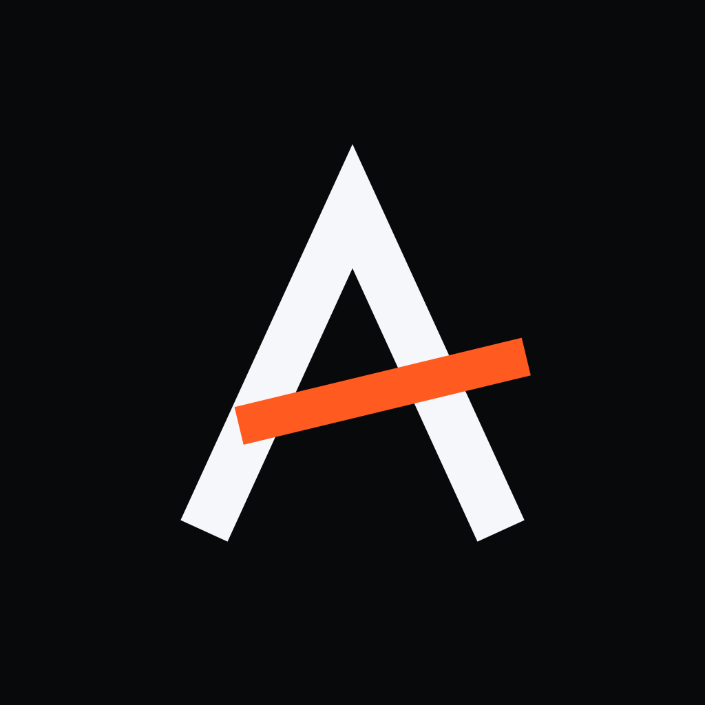
<br>
<sub><b>CHEQUERED FLAG</b> 🏁 · built for people who check the gap to P2 at dinner</sub>
</div>
